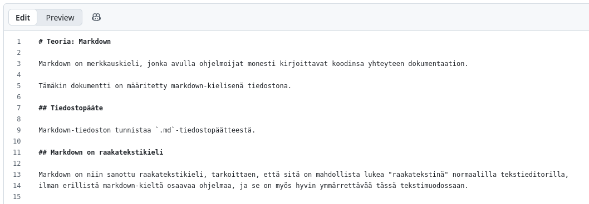
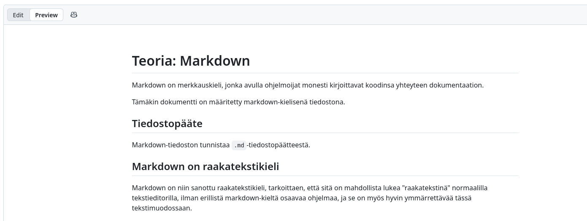

# Teoria: Markdown

Markdown on merkkauskieli, jonka avulla ohjelmoijat monesti kirjoittavat dokumentaationsa suoraan koodinsa yhteyteen tekstitiedostoina. 

Tämäkin dokumentti on määritetty markdown-kielisenä tiedostona.

## Tiedostopääte

Markdown-tiedoston tunnistaa `.md`-tiedostopäätteestä.

## Markdown:in kaksi muotoa

Markdown:ia on mahdollista lukea kääntämättömänä raakatekstina ja käännettynä html-tiedostona selaimessa.

### Markdown on raakatekstikieli

Markdown on niin sanottu raakatekstikieli, tarkoittaen, että sitä on mahdollista lukea "raakatekstinä" normaalilla tekstieditorilla, 
ilman erillistä markdown-kieltä osaavaa ohjelmaa, ja se on myös hyvin ymmärrettävää tässä tekstimuodossaan.

Alla on tämän markdown-tiedoston alku esitettynä github:in tekstieditorissa.



_Yllä: tämä tiedosto markdown-tiedostona, katseltuna github:in tekstieditorissa._

### Markdown käännetään nätimmäksi

Vaikka markdownia on mahdollista lukea myös raakatekstimuodossa, sitä ei yleensä sellaisena lueta.

Sen sijaan markdown yleensä käännetään johonkin helpommin luettavaan muotoon.

Yleensä tällainen nätimpi muoto on html, jonka selaimet osaavat näyttää.

Tälläkin hetkellä todennnäköisesti luet tätä tiedostoa juuri selaimen kautta html:ksi käännettynä tiedostona.
Tämä dokumentaatio on kuitenkin tehty markdownilla, ja vain käännetty automaattisesti github:in toimesta nätimmäksi html:ksi. 



_Yllä: tämä tiedosto markdown-tiedostona, katseltuna selaimessa, github:in renderöimänä._

Pystyt kuitenkin halutessasi lukemaan tämän tiedoston myös raakatekstimuodossaan.

## Esimerkki: otsikko markdown-syntaksilla toteutettuna

**Lyhyt markdown:in syntaksia esittelevä esimerkki:**

Jos halumme tehdä esimerkiksi html:n `h4`-otsikon, kirjoitamme sen seuraavasti markdown-tiedostossa:

```
#### tämä on html:n h4-elementtiä vastaava otsikko
```

ja tällöin se näyttää selaimessa seuraavalta:

#### tämä on html:n h4-elementtiä vastaava otsikko 

## Ohjeet

Github tarjoaa hyvän ja laajan dokumentaation markdown-kielestä.

Käytä oheista github:in ohjetta tehtävien tekemiseen:

* Github:in ohjeet: [Basic writing and formatting syntax](https://docs.github.com/en/get-started/writing-on-github/getting-started-with-writing-and-formatting-on-github/basic-writing-and-formatting-syntax)
