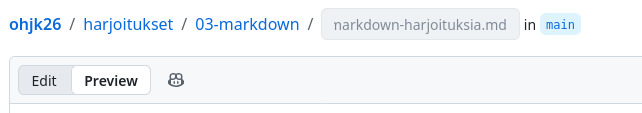

# Ohje: markdown-editorit

Kaikki kurssin html- ja markdown-harjoitukset on tarkoitus tehdä moodlessa määritettyyn github classroom -repositorioon.

Markdown-tehtävät voi tehdä:

* lokaalisti omalla koneellasi, käyttäen vscode-tekstieditoria, mutta
* ne voi tehdä myös käyttäen github:in selaimessa toimivaa tekstieditoria.

## Testaa tekemiäsi markdown-tiedostot käyttäen esikatselutilaa

Mitä editoria käytätkin, on tärkeää kokeilla, että markdown-tiedostosi näyttävät oikeilta, käyttämällä erillistä esikatselu-tilaa.

Tämä tila on tarjolla sekä github:in tekstieditorissa, että vscode:ssa.

## Github.com:in tekstieditori

Voit tehdä tehtävät suoraan github classroom:iisi selaimessa, käyttäen github:in nettisivujen sisäänrakennettua tekstieditoria.

Alta löytyvät ohjeet github.com:in sisäänrakennetun tekstieditorin käyttöön.

### Uuden tiedoston luonti ja tekstieditorin avaaminen github.com:issa

Tekstieditorin avaaminen, uutta tiedostoa varten, onnistuu klikkaamalla github classroom -repositoriossasi "add file"-nappia:

### Tiedoston nimen ja kansion vaihtaminen

Github:in tekstieditorissa voit lisätä tiedoston nimen eteen hakemiston, lisäämällä `/`-merkin hakemiston jälkeen. 
Vastaavasti, pääset takaisin muokkaamaan aiemman kansion nimeä poistamalla tuon `/`-merkin askelpalauttimella (engl. backspace).

### Esikatselutila github.com:in tekstieditorissa

Github.com:in tekstieditorin vasemmasta yläkulmasta löytyy preview-nappi, jonka avulla voit katsella markdown-tiedostoa esikatselutilassa.

## vscode-tekstieditori omalla koneellasi

Vscode:n pitäisi olla tuttu aiemmista html-tehtävistä.

Myös siitä löytyy esikatselutila markdown-tiedostoille.

### Esikatselutila vscode:ssa

Vscode:n tiedostoselaimessa (vasen näkymä) klikkaa hiiren oikealla näppäimelllä markdown-tiedostoa (pääte `.md`), jota haluat katsella esikatselutilassa, 
ja valitse avautuvasta kontekstivalikosta "preview"-kohta.

Vscoden pitäisi tällöin avata uusi välilehti "preview"-nimellä, jossa markdown-tiedosto näytetään sellaisena, kuin se näyttäisi html-tiedostoksi renderöitynä.
